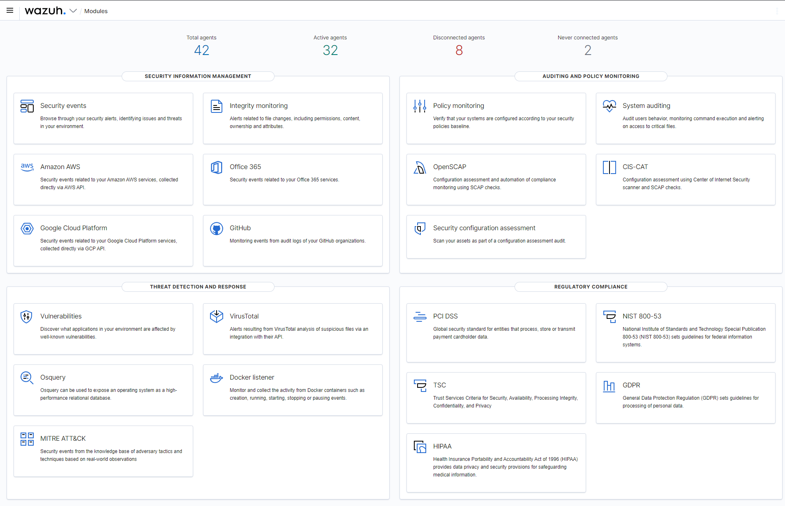
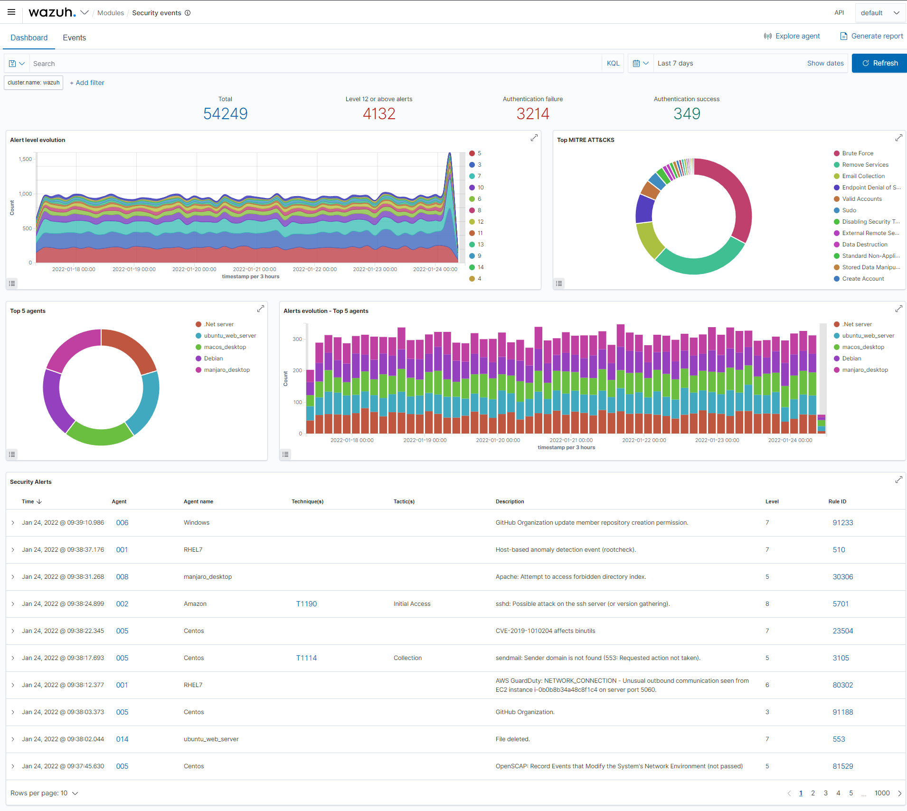
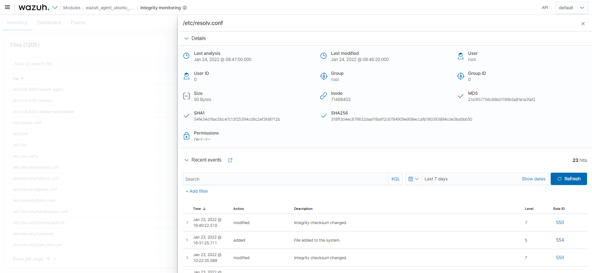
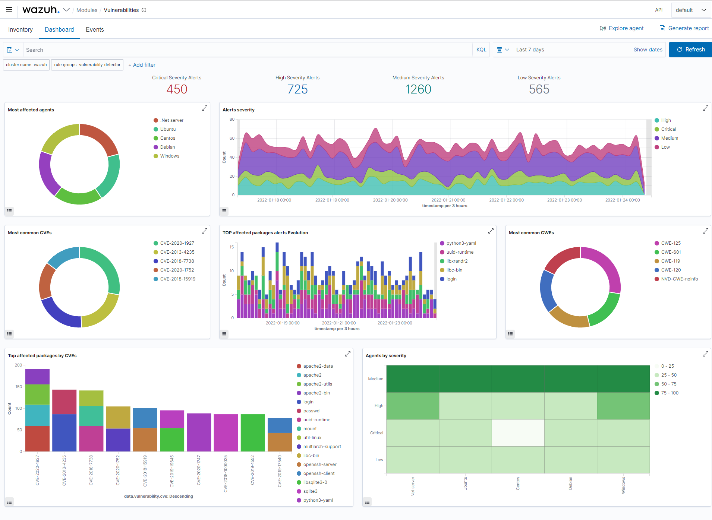
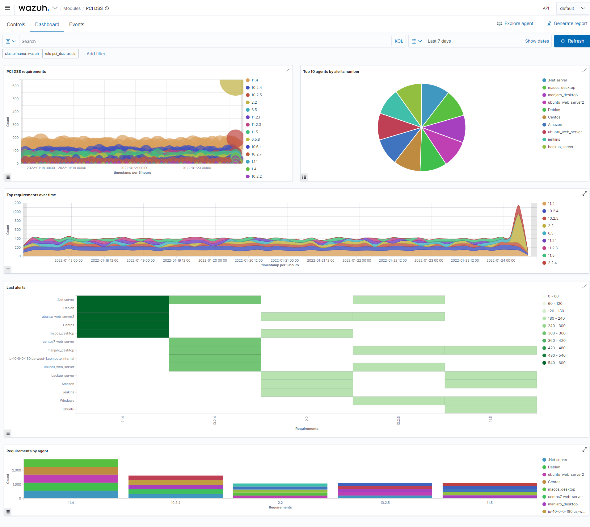
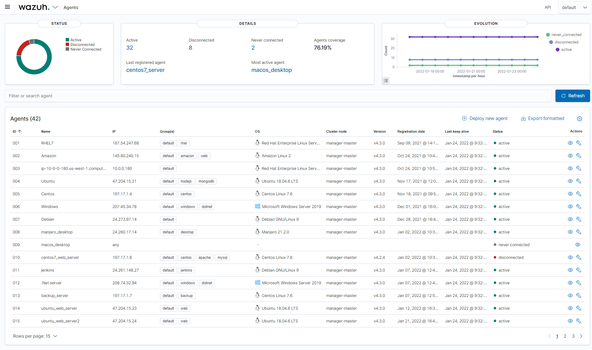
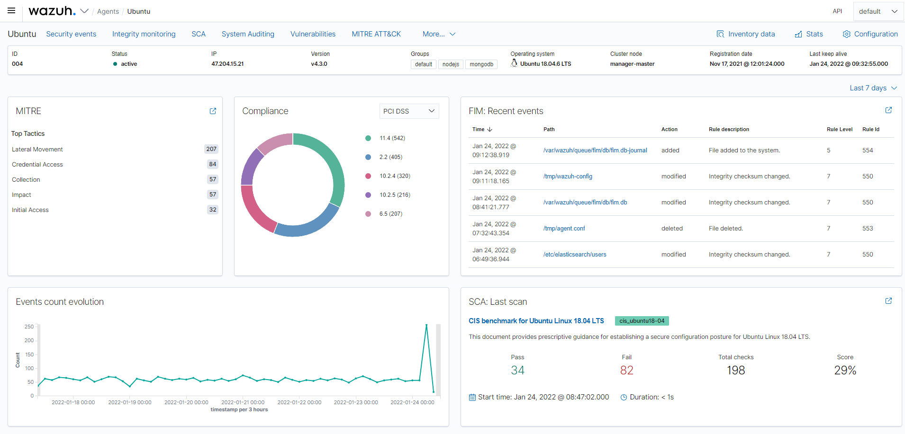

    

    
    
    
    

- [Welcome](#welcome)
- [Project resources](#project-resources)
- [Xcyber360 UI](#xcyber360-ui)
- [Contribute](#contribute)
- [License](#license)
- [Copyright](#copyright)

<!--

-->

## Welcome

This repository contains a set of plugins for [Xcyber360 dashboard][dashboard].

Xcyber360 is a security detection, visibility, and compliance open source project. Xcyber360 helps
you to gain deeper security visibility into your infrastructure by monitoring hosts at an
operating system and application level.

You can learn more about it at [xcyber360.com][web]

## Project resources

- [Project website][web]
- [Documentation][docs]
- [Installation guide][install]
- Need help? Join us on [Slack][slack]!
- [Contributing](CONTRIBUTING.md)
- [Styleguide](STYLEGUIDE.md)
- [Security](SECURITY.md)
  <!-- - [Contributing](CONTRIBUTING.md) -->
  <!-- - [Maintainer Responsibilities](MAINTAINERS.md) -->
  <!-- - [Release Management](RELEASING.md) -->
  <!-- - [Testing](TESTING.md) -->

## Xcyber360 UI

**Overview**

    

**Security events**

    

**Integrity monitoring**

    

**Vulnerability detection**

    

**Regulatory compliance**

    

**Agents overview**

    

**Agent summary**

    

## Contribute

If you want to contribute to our project please don't hesitate to send a pull request.
Take a look at the [branches and tags][branches] page in our Wiki, and also to our
[contributing](CONTRIBUTING.md) guidelines.

## License

This project is licensed under the [GNU General Public License v2.0](LICENSE).

This program is free software; you can redistribute it and/or modify it under the terms
of the GNU General Public License as published by the Free Software Foundation; either
version 2 of the License, or (at your option) any later version.

## Copyright

- Copyright &copy; Xcyber360, Inc.

[dashboard]: https://github.com/xcyber360/xcyber360-dashboard
[web]: https://xcyber360.com
[docs]: https://documentation.xcyber360.com
[install]: https://documentation.xcyber360.com/current/installation-guide/index.html
[slack]: https://join.slack.com/t/xcyber360/shared_invite/zt-1lgu531ur-7M_k_ZQbpdo4QCn_pHee3w
[branches]: https://github.com/XCyber360/XCyber360/tree/master/dashboard/plugins/wiki/About-our-branches-and-tags
[wiki]: https://github.com/XCyber360/XCyber360/tree/master/dashboard/plugins/wiki
